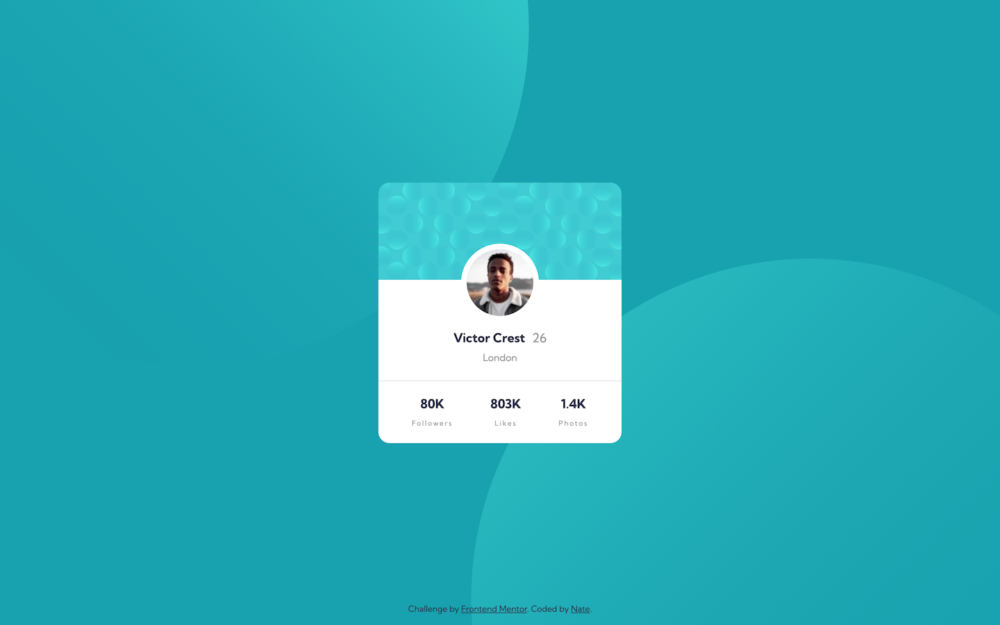

# Frontend Mentor - Profile card component solution

This is a solution to the [Profile card component challenge on Frontend Mentor](https://www.frontendmentor.io/challenges/profile-card-component-cfArpWshJ). Frontend Mentor challenges help you improve your coding skills by building realistic projects. 

## Table of contents

- [Overview](#overview)
  - [The challenge](#the-challenge)
  - [Screenshot](#screenshot)
  - [Links](#links)
- [My process](#my-process)
  - [Built with](#built-with)
  - [What I learnt](#what-i-learnt)
- [Author](#author)
- [Acknowledgments](#acknowledgments)

## Overview

### The challenge

- Build out the project to the designs provided

### Screenshot

### Links

- Solution URL: [Add solution URL here](https://your-solution-url.com)
- Live Site URL: [ntjnh-fem-profile-card.netlify.app](https://ntjnh-fem-profile-card.netlify.app/)

## My process

### Built with

- Semantic HTML5 markup
- SCSS
- Flexbox
- Mobile-first approach

### What I learnt

Didn't really learn anything new but it was good practice to build something different based on a provided design.

## Author

- Website - [Nate](https://natejonah.com/)
- Frontend Mentor - [@ntjnh](https://www.frontendmentor.io/profile/ntjnh)
- Twitter - [@natejonah](https://www.twitter.com/natejonah)
